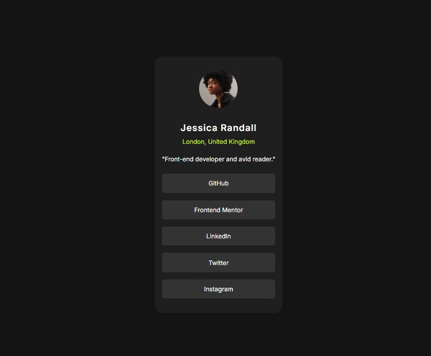

# Frontend Mentor - Social links profile solution

## Table of contents

- [Overview](#overview)
  - [The challenge](#the-challenge)
  - [Screenshot](#screenshot)
  - [Links](#links)
- [My process](#my-process)
  - [Built with](#built-with)
  - [What I learned](#what-i-learned)
- [Author](#author)

## Overview

### The challenge

Users should be able to:

- See hover and focus states for all interactive elements on the page

### Screenshot

### Links

- Live Site URL: [Check the live site](https://jani-b.github.io/FEM-social-links-profile/)

## My process

### Built with

- Semantic HTML5 markup
- CSS (Flex to center content to middle of the screen)
- Mobile-first workflow

### What I learned

I made this challenge mobile first. Even when there was not much difference between mobile and bigger screen versions.

## Author

- Frontend Mentor - [@Jani-B](https://www.frontendmentor.io/profile/Jani-B)
- Twitter - [@yourusername](https://www.twitter.com/yourusername)
